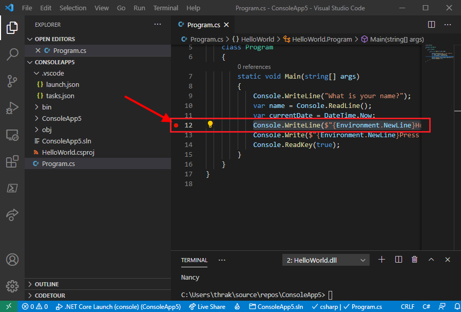
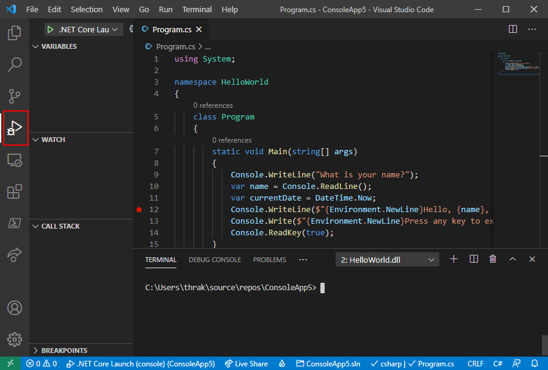

## 새 프로젝트 생성
1. visual studio code를 시작한다
2. Ctrl+Shift+P(MacOS의 경우 Command+Shift+P)를 사용하여 명령 팔레트를 표시한 다음 ".NET"을 입력하고 .NET: new Project 명령을 찾아서 선택할 수 있습니다.

3. 명령 입력후 프로젝트 템플릿에서 console을 선택

4. 새 프로젝트를 생성할 디렉터리를 지정
5. 새 프로젝트에 "HelloWorld"라는 이름을 지정

6. 모든 템플릿 옵션을 표시 > 최상위문 사용안함 *True*(선택)
> 학습을 하는 경우엔 true를 추천
- 최상위문 사용 안함 **False**

```C#
// See https://aka.ms/new-console-template for more information
Console.WriteLine("Hello, World!");
```

 - 최상위문 사용 안함 **True**

```C#
using System;
namespace Application
{
    class Program
    {
        static void Main(string[] args)
        {
            Console.WriteLine("Hello World!");
        }
    }
}
```

7. 프로젝트 생성

## 앱 실행
Run > Run Without Debbuging(windows: Ctrl+F5, mac: ^+F5)

## 디버그 빌드 구성 사용
#### 중단점 설정
- 코드창의 왼쪽 여백을 클릭 혹은 F9


#### 디버깅 시작
1. 왼쪽 메뉴에서 run and Debug 메뉴 선택


2. run and Debug 버튼 클릭(혹은 상단 메뉴바 Run > Start Debbuging(F5))


---

#### CLI를 이용한 프로젝트 생성
1. 명령 실행
`dotnet new console -o MyConsoleApp`
옵션	설명
dotnet	.NET CLI를 호출하는 명령어.
new	새로운 프로젝트 또는 파일을 생성.
console	콘솔 애플리케이션 템플릿을 사용.
-o MyConsoleApp	생성된 프로젝트를 “MyConsoleApp” 폴더에 저장.

| 옵션    | 설명    |
|----------|:----------:|
| dotnet  | .NET CLI를 호출하는 명령어.  |
| new  | 새로운 프로젝트 또는 파일을 생성.  |
| console  | 콘솔 애플리케이션 템플릿을 사용.  |
| -o MyConsoleApp  | 생성된 프로젝트를 “MyConsoleApp” 폴더에 저장.  |
||

2. 프로젝트 폴더로 이동
`cd MyConsoleApp`

3. 프로젝트 열기
`code .`

4. 빌드     
`- dotnet run`  
`- dotnet run --configuration Release`(릴리즈)

---

[참고 자료](https://learn.microsoft.com/ko-kr/dotnet/core/tutorials/with-visual-studio-code)

