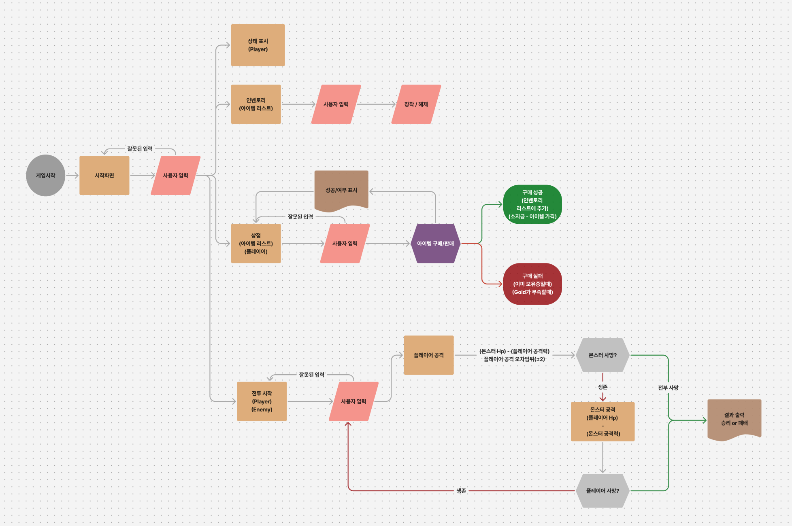
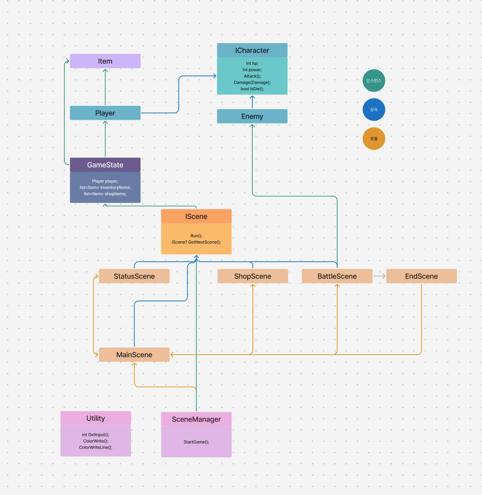

# TextRPG 만들기 🖥️ 


내일배움캠프 Unity과정 첫 팀 프로젝트로 C# 콘솔로 TextRPG를 만들게 되었다.

본 카테고리에선 프로젝트를 진행과정을 기록할 예정이다.

## 1. 플로우 차트 구성 



- **플로우 차트**

  팀원들과 가장 먼저 시작한건 플로우 차트 작성이였다. 와이어프레임 대신 플로우 차트를 작성한 이유는 아무래도 텍스트로만 이루어진 콘솔창이다 보니 비주얼적인 구상보단 흐름이라고 생각했기 때문이다. 그래서 후에 다이어그램을 만들때 참고하기 위한 용도로만 작성하였다.

## 2.클래스 다이어그램



- **클래스 다이어그램**

  앞서 만든 플로우차트를 참고하여 다이어그램을 구상하였다. 다이어그램은 내가 생각하기에 실제로 코드를 작성하기 전에 가장 신중하고 꼼꼼히 작성해야하는 것중에 하나라고 생각한다. 이유는 얼마나 체계적으로 구상했냐에 따라 작업기간 또한 줄어들고 잘못된 구조로인해 여태껏 했던 작업물들이 허무하게 버려지는 경우하 허다하기 때문이다

## 3.기본틀 작성

- 이번 프로젝는 팀프로젝트이다. 때문에 처음부터 기능구현을 분담하고 시작하기에는 서로마다 스타일도 다르고 지식또한 다르기에 불가능에 가깝다고 생각했다. 그래서 이 프로젝트의 가장 핵심적이고 기초인 것들이 다음과 같다고 생각했다.

  1. **플레이어의 입력**
     - 매 씬마다 **최소 1번 이상** 의 사용자의 정수 **입력**을 요구한다.
  2. **텍스트 컬러 출력**
     - 텍스트가 전부인 게임에서 그나마 비주일적인 요소로 쉽게 접근할 수 있는게 색상이다.
  3. **각 Scene의 이동** 
     - 처음에는 **한개의 `Class`**와 **한개의 파일** 안에서 **함수로 각씬들을 통제하려했다**. 이전 튜터님의 해설영상에서 사용한 코드라 대부분의 사람이 이 방식을 생각했을 것이다. 그러나 염려 되는 부분이 있었다. 앞서 말했듯 이 프로젝트는 팀프로젝트이기 때문에 하나의 파일에서 여러명이 공동으로 작업한다는건 여러 문제들(머지충돌 등)있어서 그다지 마음에 들지 않았다.

  > **해결**

  1. `Utility` 라는 정적`static` 클래스를 만들어 **입/출력**을 관리하기로했다.

  2. `SceneManager`가 인터페이스`IScene`을 상속받는 모든 `Scenes` 를 관리 하기로 했다.

  

  ## 4. SceneManager

  - `SceneManger`은 이름과는 다르게 씬을 관리하기보단 그저  **초기 진입 & Scene 전환**의 역할을 담당한다. 

    ```csharp
    //SceneManager.cs
    public class SceneManager
    {
        private IScene? _currentScene;
    
        public SceneManager(IScene startScene)
        {
            _currentScene = startScene; // 초기 씬 설정
        }
    
        public void StartGame()
        {
            while (_currentScene != null)
            {
                _currentScene.Run(); // 현재 씬 실행
    
                // 다음 씬으로 이동
                _currentScene = _currentScene.GetNextScene();
            }
    
            Console.WriteLine("Game Over.");
        }
    }
    
    //Program.Cs
    class Program
    {
        static void Main(string[] args)
        {
            GameState gameState = new GameState(); //유일하게 인스턴스 생성
            
            var initialScene = new TestScene(gameState); // 첫 번째 씬 설정
    
            var sceneManager = new SceneManager(initialScene);
            sceneManager.StartGame(); // 게임 시작
    
        }
    }
    ```


## 5. **Interface IScene**

-  모든 `Scene`들이 상속받는 인터페이스이다. 구성 필드와 메서드는 다음과 같이 간단하다.

```csharp
//IScene.cs
// 씬 인터페이스: 씬 실행 및 다음 씬 반환
public interface IScene
{
    // 씬을 실행
    void Run();

    // 다음 씬을 반환 (null이면 종료)
    IScene? GetNextScene();
}
```


- 팀원들에게 예제로 보여줬던 `Scene`의 예시이다.

  ```csharp
  // ExampleScene.cs 
  // 씬 예제 파일 입니다. 새로운 씬 만들때 해당 파일 복사해서 이름만 바꾸세요!
  namespace TextRPG_Team.Scenes;
  
  public class ExampleScene : IScene
  {
      private readonly GameState _gameState;
  
      public ExampleScene(GameState gameState) //DI 의존성 주입
      {
          _gameState = gameState;
      }
  
      public void Run()
      {
          Console.Clear(); //처음 진입시 화면 지우기
          
          //예제 로직
          // 현재 씬에 대한 이름 출력
          Console.WriteLine("ExampleScene.");      
      }
  
      public IScene? GetNextScene()
      {
          int input = Utility.GetInput(1, 2);
          return input switch     //  C#의 `switch 표현식` 입니다.
          {
              1 => this, // 같은 씬 유지
              2 => new MainScene(_gameState), // 메인 씬으로 돌아감
              _ => null // 잘못된 입력 시 종료
          };
      }
  }
  ```

## 6. GameState

- 씬전환의 구상을 끝내고 생각해보니 모든 Scene에서 다양한 **인스턴트들을 공유**해야 한다는것을 깨달았다.(ex Player, Item List)
- 이를 해결하기위해 **의존성 주입**`Dependency Injectio,DI` 를 위해 생성한 `Class`이다. 
- 해당 클래스 안에 공통적으로 필요한 모든 인스턴스를 생성하고 각`Scenes`에 주입시키는 것이다.

```csharp
//GameState.cs
public class GameState
{
    //씬전환간에 필요한 인스터스들
    public Queue<string> Logs { get; } = new(); //Log Info를 저장할 Queue입니다.
}

//예시
    public IScene? GetNextScene()
    {
        int input = Utility.GetInput(1, 2);
        return input switch     //  C#의 `switch 표현식` 입니다.
        {
            1 => this, // 같은 씬 유지
            2 => new MainScene(_gameState), // 메인 씬으로 돌아감
            _ => null // 잘못된 입력 시 종료
        };
    }
```

---

## 마무리 

- 이로써 내생각에 팀작업을 시작하기 위한 기본 로직은 완성 되었다고 생각한다.
- 이제 기능구현을 분담하여 무사히 프로젝트를 끝마치는 것만 남았다. 
- **-끝-**